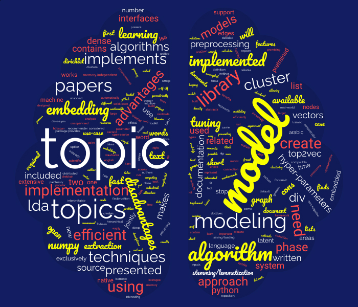

﷽

Topic Modeling Libraries

Written by **CHEBBAH Mehdi**

---

# Introduction

*Topic modeling* (or *topic extraction*) is a technique in Natural Language Processing (NLP) that allows the machine to automatically extract meaning from text by identifying recurrent abstract themes or topics, represented generally by the most relevant keywords.

In this article we will be presenting some of the most interesting topic modeling algorithms such us: LDA, NMF, Top2Vec, and BERTopic. We will also discuss some of the most used implementations of these algorithms.

---

# Topic Modeling Algorithms

In this section, we will go through the most used Topic Modeling algorithms, by presenting an overview of each of them, explain how it works, and extract its characteristics that play an important role when choosing the right model to use to solve your problem.

## 1. LDA

**LDA** or **Latent Dirichlet Allocation** is a probabilistic model proposed by *Pritchard*, *Stephens*, and *Donnelly* in 2000. Then it was applied in machine learning by *Blei David*, *Ng Andrew*, and *Jordan Michael* in 2003. 

Technically, a document in **LDA** is a probability distribution of topics and a topic in its turn is a probability distribution of words, so in the training phase, **LDA** model tries to find -in the same time- the best distribution of topics in each Document, and the best distribution of words in each topic that describe better the dataset. And this is how it does that:

+ The model takes two inputs: **The Document-Term Matrix** (The order of words is ignored in LDA so the input is **BOW: Bag Of Words**) and **the Number of Topics $K$** this number is hard to detect beforehand, so this hyper-parameter have to be fine-tuned.

2. Assign each word in each document to a random Topic which will give a **Bad** distribution of topics over documents and a **Bad** distribution of words over topics.

3. For each document $d_i$ and for each Word $w_j$, calculate $P(w_j | t_k)$ and $P(t_k|d_i)$ for each Topic $t_{k=1,2,..,K}$.

    **Note**: In some implementations of LDA, two density factors are introduced in the calculation of these probabilities: A document-topic density factor $\alpha$ and a topic-word density factor $\beta$ which are two other hyper-parameters for the model.

4. Re-assign each word to a topic where  $P(w_j | t_k) \cross P(t_k|d_i)$ is maximum.

4. Repeat steps 3 and 4 until the model converges or to a pre-defined number of iterations.

+ The output of the model is the distribution of the topics over documents and the distribution of words over topics

### Properties

+ Consider a document as a mixture of topics.
+ Works better with long texts.
+ A non-deterministic approach.
+ Language agnostic.

## 2. NMF

**NMF** or **Non-negative Matrix Factorization** is a Linear-algebraic model. The basic idea behind it is to try to factories the input $A$ -which is the words-documents matrix- to get two other matrices (words-topics matrix $W$ and topics-documents matrix $H$) where $A = W \times H$. The algorithm for calculating these matrices is described bellow:

+ The input for this model is the words-documents matrix $A$ of dimension $(n\times m)$ and the number of topics $K$.

1. Randomly initialize the two matrices $W$ of dimension $(n \times K)$ and $H$ of dimension $(K \times m)$.
2. Reconstruct the matrix $\hat{A} = W \times H$.
3. Calculate the distance between $A$ and $\hat{A}$ (euclidean distance).
4. Update values in $W$ and $H$ based on an objective function.
5. Repeat steps 2, 3, and 4 until convergence.

+ The output of the model is $W$ and $H$ matrices.

### Properties

+ Calculates how well each document fits each topic.
+ Usually faster than LDA.
+ Works better with short texts.
+ A deterministic approach.
+ Language agnostic.

## 3. Top2Vec

**Top2Vec** is an algorithm for topic modeling and semantic search. It automatically detects topics present in text and generates jointly embedded topic, document and word vectors. It was first published in arXiv by *Dimo Angelov* in 2020. It works as follows:

+ The model takes the collection of documents only as an input.

1. Embed the inputs using the an Embedding model (There are three options for accomplishing this task: **Universal Sentence Encoder (USE)**, **Sentence BERT (SBERT)**, and **Document to Vector (Doc2Vec)**.
2. Reduce the dimensionality of the Embeddings space using the **UMAP** algorithm to create dense areas. These dense areas contain geometrically close words (Semantically close Words).
3. Cluster the results using a density-based clustering algorithm (The **HDBSCAN** is used here). Then calculate the centroids of each cluster (These centroids are considered as the representative vector of the topic).
4. Get the $K$ closest words to the center of each cluster using the **K-NN** algorithm (These words represent the keywords of each topic). 

+ The outputs of this model are the list of topics and keywords and the trained model that could be used later to cluster new documents into the right topic.

### Properties

+ Training is slow.
+ Automatically finds number of topics.
+ Works on short text.
+ Language agnostic if used with doc2vec embedding technique.
+ A non-deterministic approach.
+ Bad with few number of documents.

## 4. BERTopic

**BERTopic** is a topic modeling technique that leverages transformers and c-TF-IDF to create dense clusters allowing for easily interpretable topics whilst keeping important words in the topic descriptions. **BERTopic** is the newest topic modeling technique in the list, it was published in 2020 by *Maarten Grootendorst*. It works as follows:

+ It only takes one input which is the collection of documents.

1. Embed documents using a BERT-based embedding model.
2. the right Transformers-based pretrained model for your language as this approach doesn’t contain a training neither a fine-tuning to the embedding model.
3. the right Transformers-based pretrained model for your language as this approach doesn’t contain a training neither a fine-tuning to the embedding model.
4. Cluster documents by reducing the dimensionality 
    1. Lower the dimensionality of the Embeddings using the **UMAP** algorithm.
    2. Create clusters using a density-based algorithm such **HDBSCAN**.
5. Create topics from these clusters, by:
    1. Apply a modified version of TF-IDF called class-based TF-IDF (c-TF-IDF) . This version relies on the idea that instead of calculating the importance of words in documents (which is done by TF-IDF) we calculate the importance of words in clusters. Which will allow us to get the most important words in each topic (Representative words).
    2. Improve the coherence of words in each topic, using the **Maximal Marginal Relevance (MMR)** to find the most coherent words without having too much overlap between the words themselves. This results in the removal of words that do not contribute to a topic.

+ The results of this model is the list of Topics and top keywords in each topic in addition to the model that could be used later for extracting topics from new Documentents.

### Properties

+ Training is slow.
+ Automatically finds number of topics.
+ Works on short text.
+ A non-deterministic approach.
+ Language agnostic (Any Transformers-based embedding model could be used for embedding phase).
+ Bad with few number of documents.

---

# Topic Modeling Libraries

In this section, some interesting libraries that implement different topic extraction techniques are presented with an explanation of the advantages and disadvantages of using each  implementation.

## [Scikit-learn](https://scikit-learn.org/)

The first library on our list is *Scikit-learn* which is an open-source machine learning library that supports *supervised* and *unsupervised* learning. This library implements two Topic modeling algorithms: **Latent Dirichlet Allocation (LDA)** and **Non-negative Matrix Factorization (NMF)**. The pros and cons of this implementation to the algorithms are presented here:

+ **Advantages**

  + Extensive documentation.
  + Intuitive interfaces.
  + Very popular.
  + Open-source.

+ **Disadvantages**

  + Preprocessing phase not included (This phase should be implemented by the developer).
  + The need for hyper-parameters tuning (Parameter tuning is time and resources consuming).
  + No native support for saving/loading the model. In fact, there are workarounds but they are not reliable in the case of large models.

## [Gensim](https://radimrehurek.com/gensim/apiref.html)

*Gensim* is a free open-source Python library for representing documents as semantic vectors, as efficiently and painlessly as possible. This library implements three topic extraction techniques: **LDA**, **Latent Semantic Analysis** (**LSA**), and **Hierarchical Dirichlet Process (HDP)**. The advantages and disadvantages are presented here:

+ **Advantages**

  + Memory-independent (Datasets larger than the available RAM could be loaded in batch mode to the algorithm).
  + Intuitive interfaces.
  + Distributed computing (The algorithm could be run on a cluster).
  + Extensive documentation.
  + Implemented in Fortran/C (Fast).
  + Open-source.

+ **Disadvantages**

  + Preprocessing phase not included.
  + The need for hyper-parameters tuning.

## [Numpy ML](https://numpy-ml.readthedocs.io/en/latest/)

The next option is *Numpy ML* which is a growing collection of machine learning models, algorithms, and tools written exclusively in *NumPy* and the Python *standard library*. The only topic modeling algorithm implemented in this library is **LDA**. This implementation has its features and inconveniences:

+ **Advantages**

  + Implemented exclusively in *NumPy* which makes it fast and compatible with data types used in the library.

+ **Disadvantages**

  + Preprocessing phase not included.
  + The need for hyper-parameters tuning.
  + No native support for saving/loading the model.

## [Familia](https://github.com/baidu/Familia)

*Familia* is an open-source project. A Toolkit for Industrial Topic Modeling. It implements **LDA**, **SentenceLDA**, and **Topical Word Embedding (TWE)**. Here are the pros and the cons:

+ **Advantages**

    + Industrial oriented

+ **Disadvantages**

    + Documentation available only in Chinese.

## [Top2vec](https://top2vec.readthedocs.io/en/latest/)

*Top2Vec* is a python library designed to learn jointly embedded topics, documents, and word vectors. It is the only implementation of the **Top2Vec** algorithm. It is a promising approach that uses techniques of Deep Learning to solve this problem. Here are the benefits and drawbacks of this approach:

+ **Advantages**
  + No stop word lists are required.
  + No need for stemming/lemmatization.
  + Has search functions built-in.
  + Contains pretrained Embedding models (USE or SBERT).
  
+ **Disadvantages**

  + You don’t have control over all the steps.

## [BERTopic](https://maartengr.github.io/BERTopic/index.html)

This library implements the **BERTopic** model which leverages *the BERT* model and Class-based TF-IDF (*c-TF-IDF)* to create dense clusters allowing for easily interpretable topics while keeping important words in the topic descriptions. This model has a lot of features that make it the best model in this list but at the same time has its own drawbacks that make you think before using it.

+ **Advantages**

  + Works with all transformers-based Embedding models.
  + Automatically finds the number of topics.
  + No stop word lists are required.
  + No need for stemming/lemmatization.
  + Works on short text.

+ **Disadvantages**

  + The library contains some unsolved issues in its official Github repository.

## [Text2vec](http://text2vec.org/)

*text2vec* is an R package that provides an efficient framework with a concise API for text analysis and natural language processing (NLP). This library implements the **LDA** and **LSA** algorithms. The pros and cons of this implementation are presented below:

+ **Advantages**
  + Is written in C++ (Fast).
  + expose unified interfaces (Easy to use).
  + Memory efficient.
  
+ **Disadvantages**

  + Available only in R language.

---

# References

+ http://genetics.org/content/155/2/945
+ https://jmlr.csail.mit.edu/papers/v3/blei03a.html
+ https://en.wikipedia.org/wiki/Latent_Dirichlet_allocation#cite_note-blei2003-3
+ https://medium.com/ml2vec/topic-modeling-is-an-unsupervised-learning-approach-to-clustering-documents-to-discover-topics-fdfbf30e27df
+ https://www.researchgate.net/figure/Conceptual-illustration-of-non-negative-matrix-factorization-NMF-decomposition-of-a_fig1_312157184
+ https://github.com/MaartenGr/BERTopic
+ https://doi.org/10.5281/zenodo.4381785
+ https://top2vec.readthedocs.io/en/latest/Top2Vec.html
+ https://arxiv.org/abs/2008.09470

