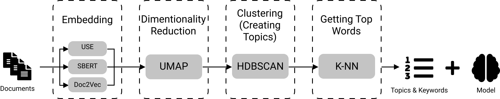
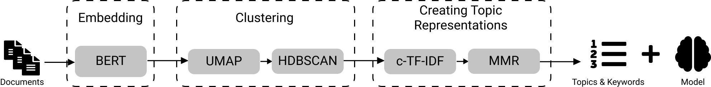

﷽

LDA, NMF, Top2Vec, and BERTopic. How do they work?

Written by **CHEBBAH Mehdi**

---

# Introduction

*Topic modeling* (or *topic extraction*) is a technique in Natural Language Processing (NLP) that allows the machine to extract meaning from text by identifying recurrent abstract themes or topics represented by the most relevant keywords.

In this article, we will go through the literature on Topic Modeling. We will present an overview of the most interesting techniques, explain how they work, and extract their characteristics that play an important role when choosing the right model for your problem.

## LDA

**LDA** or **Latent Dirichlet Allocation** is a probabilistic model proposed by *Pritchard*, *Stephens*, and *Donnelly* in 2000. Then it was applied in machine learning by *Blei David*, *Ng Andrew*, and *Jordan Michael* in 2003. 

Technically, a document in **LDA** is a probability distribution of topics and a topic in its turn is a probability distribution of words, so in the training phase, **LDA** model tries to find -in the same time- the best distribution of topics in each Document, and the best distribution of words in each topic that describe better the dataset. And this is how it does that:

+ The model takes two inputs: **The Document-Term Matrix** (The order of words is ignored in LDA so the input is **BOW: Bag Of Words**) and **the Number of Topics $K$** this number is hard to detect beforehand, so this hyper-parameter have to be fine-tuned.

2. Assign each word in each document to a random topic which will give a **Bad** distribution of topics over documents and a **Bad** distribution of words over topics.

3. For each document $d_i$ and for each Word $w_j$, calculate $P(w_j | t_k)$ and $P(t_k|d_i)$ for each topic $t_{k=1,2,..,K}$.

    **Note**: In some implementations of LDA, two density factors are introduced in the calculation of these probabilities: a document-topic density factor $\alpha$ and a topic-word density factor $\beta$ which are two other hyper-parameters for the model.

4. Re-assign each word to a topic where  $P(w_j | t_k) \cross P(t_k|d_i)$ is maximum.

4. Repeat steps 3 and 4 until the model converges or to a pre-defined number of iterations.

+ The output of the model is the distribution of the topics over documents and the distribution of words over topics

### Properties

+ Consider a document as a mixture of topics.
+ Works better with long texts.
+ A non-deterministic approach.
+ Language agnostic.

### NMF

**NMF** or **Non-negative Matrix Factorization** is a Linear-algebraic model. The basic idea behind it is to try to factories the input $A$ -which is the words-documents matrix- to get two other matrices (words-topics matrix $W$ and topics-documents matrix $H$) where $A = W \times H$. The algorithm for calculating these matrices is described below:

+ The input for this model is the words-documents matrix $A$ of dimension $(n\times m)$ and the number of topics $K$.

1. Randomly initialize the two matrices $W$ of dimension $(n \times K)$ and $H$ of dimension $(K \times m)$.
2. Reconstruct the matrix $\hat{A} = W \times H$.
3. Calculate the distance between $A$ and $\hat{A}$ (euclidean distance).
4. Update values in $W$ and $H$ based on an objective function.
5. Repeat steps 2, 3, and 4 until convergence.

+ The output of the model is $W$ and $H$ matrices.

### Properties

+ Calculates how well each document fits each topic.
+ Usually faster than LDA.
+ Works better with brief texts.
+ A deterministic approach.
+ Language agnostic.

### Top2Vec

**Top2Vec** is an algorithm for topic modeling and semantic search. It automatically detects topics present in text and generates jointly embedded topic, document and word vectors. **Top2Vec** was first published in arXiv by *Dimo Angelov* in 2020. It works as follows:

+ The model takes the collection of documents only as an input.

1. Embed the inputs using an Embedding model (There are three options for accomplishing this task: **Universal Sentence Encoder (USE)**, **Sentence BERT (SBERT)**, and **Document to Vector (Doc2Vec)**.
2. Reduce the dimensionality of the Embeddings space using the **UMAP** algorithm to create dense areas. These dense areas contain geometrically close words (Semantically close Words).
3. Cluster the results using a density-based clustering algorithm (The **HDBSCAN** is used here). Then calculate the centroids of each cluster (These centroids are considered as the representative vector of the topic).
4. Get the $K$ closest words to the center of each cluster using the **K-NN** algorithm (These words represent the keywords of each topic). 

+ The outputs of this model are the list of topics and keywords and the trained model that could be used later to cluster new documents into the right topic.

### Properties

+ Training is slow.
+ Automatically finds the number of topics.
+ Works on brief text.
+ Language agnostic if used with doc2vec embedding technique.
+ A non-deterministic approach.
+ Bad with few number of documents.

### BERTopic

**BERTopic** is a topic modeling technique that leverages transformers and c-TF-IDF to create dense clusters allowing for easily interpretable topics whilst keeping important words in the topic descriptions. **BERTopic** is the newest topic modeling technique in the list, it was published in 2020 by *Maarten Grootendorst*. Here how it works:

+ It only takes one input, which is the collection of documents.

1. Embed documents using a BERT-based embedding model (Choose the right Transformers-based pre-trained model for your language as this approach doesn’t contain a training neither a fine-tuning phase for the embedding model)
2. Cluster documents by reducing the dimensionality 
    1. Lower the dimensionality of the Embeddings using the **UMAP** algorithm.
    2. Create clusters using a density-based algorithm such **HDBSCAN**.
3. Create topics from these clusters, by:
    1. Apply a modified version of TF-IDF called class-based TF-IDF (c-TF-IDF) . This version relies on the idea that instead of calculating the importance of words in documents (which is done by TF-IDF) we calculate the importance of words in clusters. Which will allow us to get the most important words in each topic (Representative words).
    2. Improve the coherence of words in each topic, using the **Maximal Marginal Relevance (MMR)** to find the most coherent words without having too much overlap between the words themselves. This results in the removal of words that do not contribute to a topic.

+ The results are the list of topics and top keywords in each topic besides the model that could be used later for extracting topics from new documents.

### Properties

+ Training is slow.
+ Automatically finds the number of topics.
+ Works on brief text.
+ A non-deterministic approach.
+ Language agnostic (Any Transformers-based embedding model could be used for embedding phase).
+ Bad with few number of documents.

# Conclusion

These were 4 methods for topic modeling: 

+ A probabilistic model: LDA
+ An algebric model: NMF
+ A hybrid approach: Top2Vec, BERTopic

If you are intersted in other articles like this, visit me on:

+ My website: https://mehdi-chebbah.ml/
+ my Blog: http://mehdi-chebbah.ml/blog/
+ Medium: https://medium.com/@mehdi_chebbah
+ LinkedIn: https://www.linkedin.com/in/mehdi-chebbah/
+ Twitter: https://twitter.com/MehdiCHEBBAH1

# References

+ http://genetics.org/content/155/2/945
+ https://jmlr.csail.mit.edu/papers/v3/blei03a.html
+ https://en.wikipedia.org/wiki/Latent_Dirichlet_allocation#cite_note-blei2003-3
+ https://medium.com/ml2vec/topic-modeling-is-an-unsupervised-learning-approach-to-clustering-documents-to-discover-topics-fdfbf30e27df
+ https://www.researchgate.net/figure/Conceptual-illustration-of-non-negative-matrix-factorization-NMF-decomposition-of-a_fig1_312157184
+ https://github.com/MaartenGr/BERTopic
+ https://doi.org/10.5281/zenodo.4381785
+ https://top2vec.readthedocs.io/en/latest/Top2Vec.html
+ https://arxiv.org/abs/2008.09470
